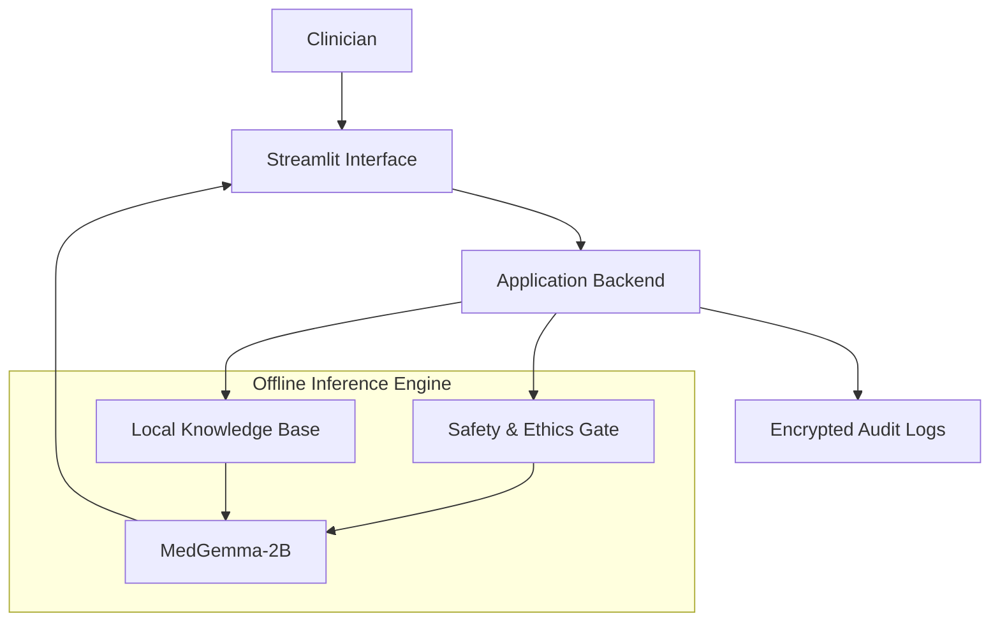

# ClinAssist Edge
### Privacy-First Offline Clinical Intelligence Platform


**ClinAssist Edge** is an offline-first clinical decision support system designed for resource-constrained environments. Built on the **MedGemma-2B** foundation model, it provides differential diagnosis, automated documentation, and safety monitoring without requiring internet connectivity or cloud infrastructure.

## System Architecture

The platform utilizes a modular, privacy-preserving architecture optimized for edge deployment on consumer hardware.

**Core Components:**
1.  **User Interface Layer**: A Streamlit-based frontend optimized for low-latency interaction and high-contrast visibility.
2.  **Application Logic**: Python-based backend handling input validation, session state management, and template rendering.
3.  **Inference Engine**: Local execution of the MedGemma-2B Large Language Model, supporting 4-bit and 8-bit quantization for reduced memory footprint.
4.  **Safety & Ethics Module**: Rule-based gating mechanisms to detect and flag high-risk outputs (e.g., contraindicated prescriptions) before they reach the user.
5.  **Retrieval-Augmented Generation (RAG)**: Vector database (FAISS) implementation for grounding model outputs in local, reliable medical guidelines.



## Key Capabilities

*   **Differential Diagnosis**: Generates ranked differential diagnoses with associated confidence scores using Bayesian uncertainty quantification.
*   **Drug Safety Analysis**: Performs real-time checks for drug-drug interactions, disease contraindications, and known allergies.
*   **Automated Documentation**: Converts unstructured clinical notes into standardized SOAP (Subjective, Objective, Assessment, Plan) formats.
*   **Patient Education**: Translates complex medical terminology into plain language instructions suitable for patients with limited health literacy.

## Installation & Deployment

### Prerequisites
*   Python 3.10 or higher
*   Minimum 4GB RAM (8GB recommended for optimal performance)
*   Operating System: Linux, MacOS, or Windows

### Quick Start
```bash
# Clone the repository
git clone https://github.com/734ai/ClinAssist-Edge.git
cd ClinAssist-Edge

# Install dependencies
pip install -r requirements.txt

# Launch the application
streamlit run app/streamlit_app.py
```

## Security & Compliance

*   **Data Sovereignty**: All processing occurs locally on the device; no patient data is transmitted to external servers.
*   **Auditability**: The system maintains immutable, encrypted logs of all interactions to support clinical audit workflows.
*   **Fail-Safe Design**: Safety layers are prioritized over model generation, ensuring that critical alerts suppress potentially unsafe AI suggestions.

## License

This project is licensed under the MIT License. See the LICENSE file for details.

---

**ClinAssist Devs** | *MedGemma Impact Challenge Submission*
